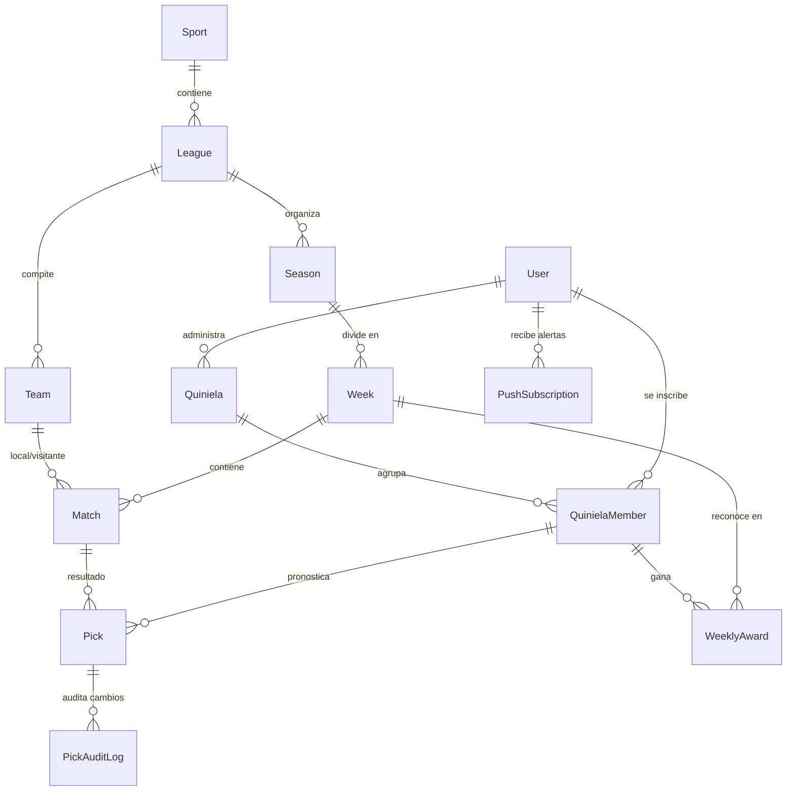

# 09 Domain Model - PickSports.API

## Diagrama Entidad-Relación

## Entidades y Responsabilidades
1. **Sport:** Catálogo de deportes soportados (`SOCCER`, `NFL`).
2. **League:** Liga o torneo (`Liga MX`, `Premier League`, `Champions League`, `NFL`).
3. **Team:** Equipo o franquicia con identificador y logo de ESPN.
4. **Season & Week:** Temporadas y jornadas deportivas.
5. **Match:** Partido programado con fecha/hora UTC, marcador y estado (`SCHEDULED`, `IN_PROGRESS`, `FINAL`).
6. **Quiniela:** Torneo o quiniela creada por un usuario con código de invitación único.
7. **QuinielaMember:** Relación entre usuario y quiniela (rol `Admin` o `Member`).
8. **Pick:** Pronóstico (`HOME`, `AWAY`, `DRAW`) emitido por un miembro para un partido.
9. **WeeklyAward:** Galardón semanal calculado (MVP, Rey de Sorpresas, etc.).
10. **PickAuditLog:** Auditoría inmutable de cómo se generó cada pick (manual vs auto-llenado).
11. **PushSubscription:** Registro VAPID del navegador para notificaciones Web Push.
12. **EspnHealthLog:** Historial de peticiones a la API de ESPN para control de cuotas y bloqueos.
